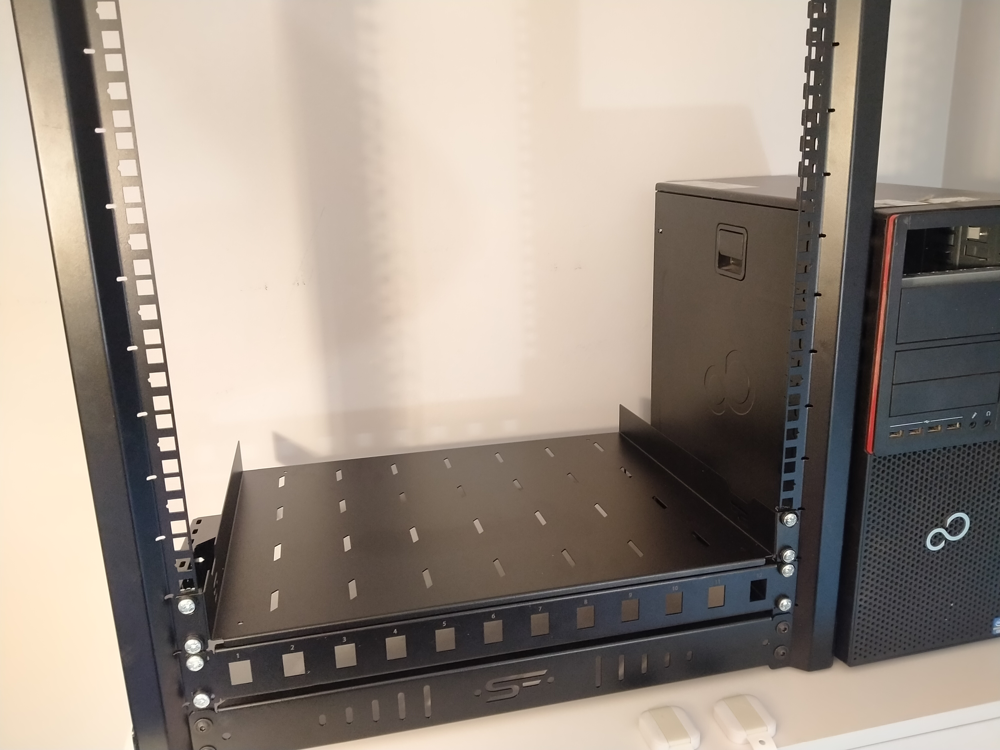
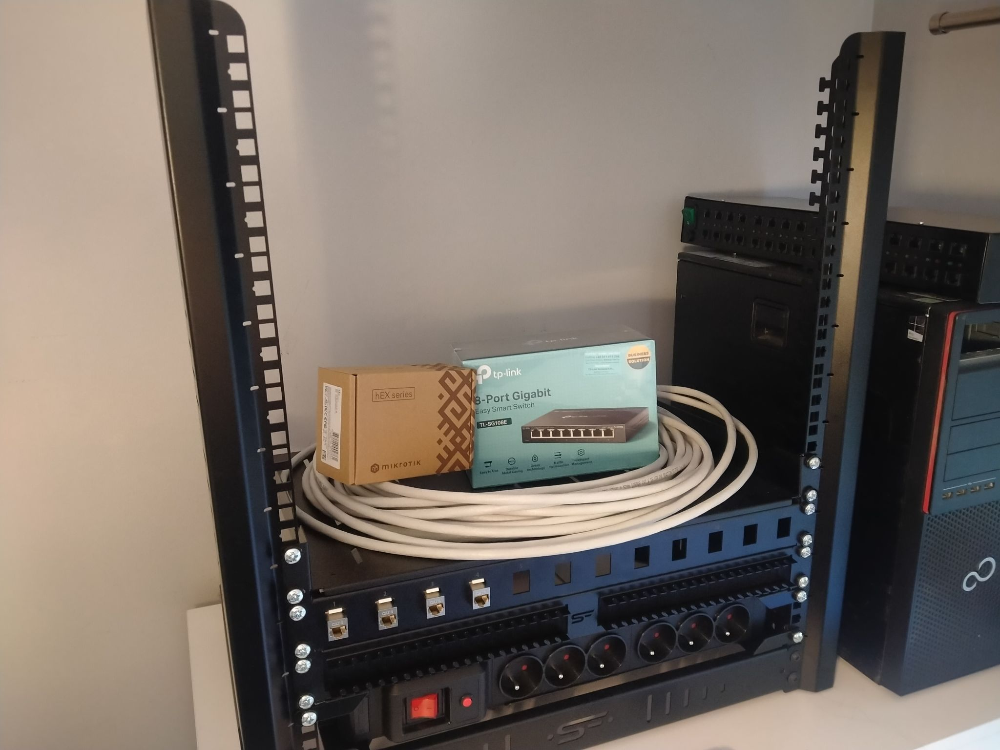
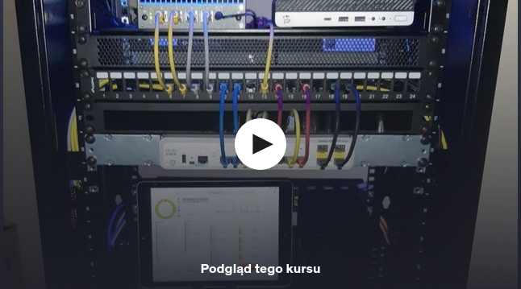

# Homelab Project 🚀

## About the project
This project is my way of developing networking skills at home. I am currently preparing for the INF.02 exam, and following the instructions from my exercise book, I plan to gather the necessary equipment to practice what I learn in theory. Furthermore, this infrastructure will play a crucial role in helping me create an interesting engineering thesis next year. 

## To Do list 🛠️
- [x] Purchase and assemble a rack tripod with a patchpanel and a shelf for future devices.
- [ ] Make 12 twisted pair cables with keystone connectors.
- [ ] Buy and plug in a managed switch.
- [ ] Purchase and configure a router for the network

## Stages of work 🧩

### 1. Assembled rack tripod 
For the beginning, I bought and assembled a rack tripod with a 12-slot patchpanel and a shelf for future devices. I also ordered CAT.6 keystones, but unfortunately, I received CAT.5e instead. As a result, I’ll need to wait a few days before I can start preparing the wires.

### 2. Infrastrucure expansion. Awaiting for proper cables.

Added a cable gland panel and a power strip. I made a mistake by ordering shielded cables, which I don’t actually need for my setup. To be honest, they are the main reason for the delay in the project. So, the switch, router, and I are currently waiting for the delivery of U/UTP Cat.6 CU cables.

## Inspirations & Resources  :books:

### 1. Home Lab Beginners guide
Free Udemy course by [Mariusz Kuriata](https://www.linkedin.com/in/mariusz-kuriata/). Priceless tips, technologies recommendation and above all: great inspiration. Moreover, thanks to his kindness, Mariusz has made this course available for free.

    

